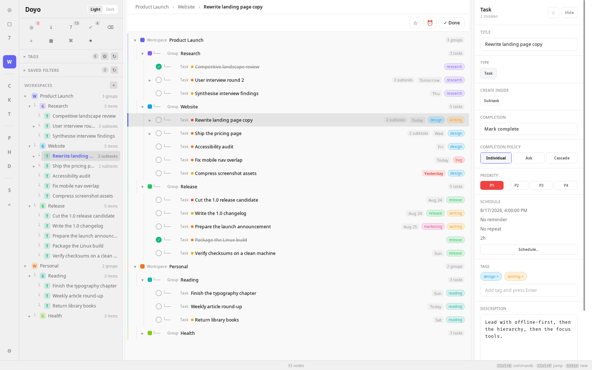
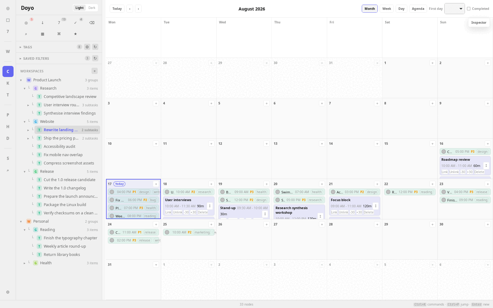
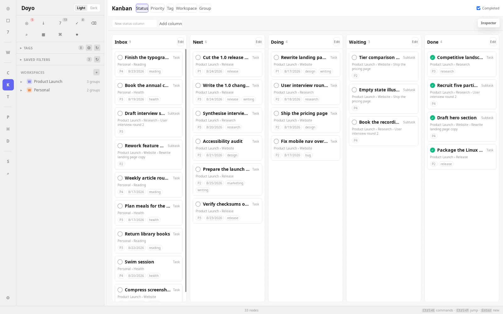
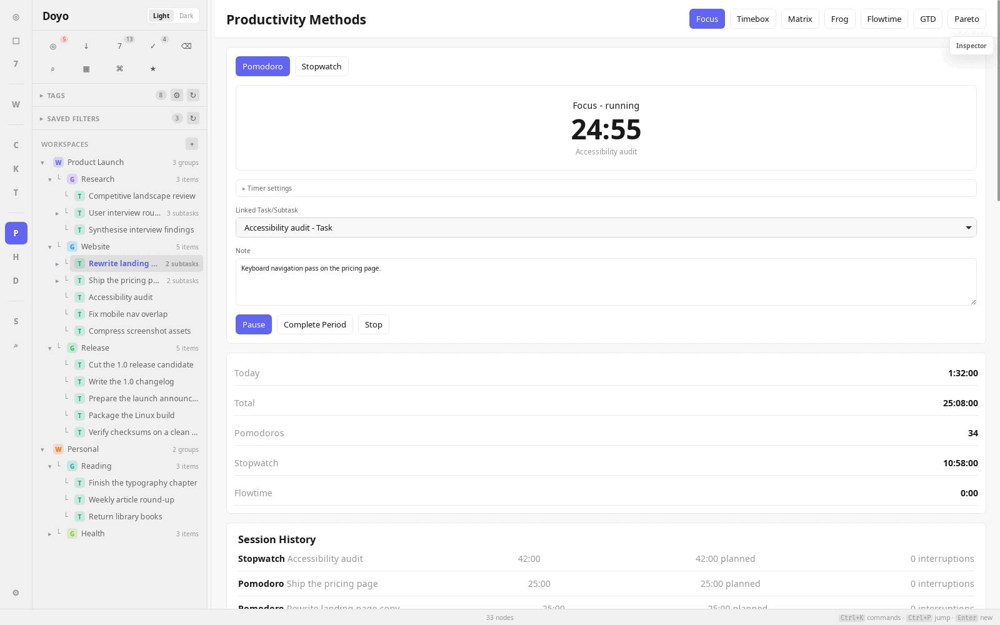
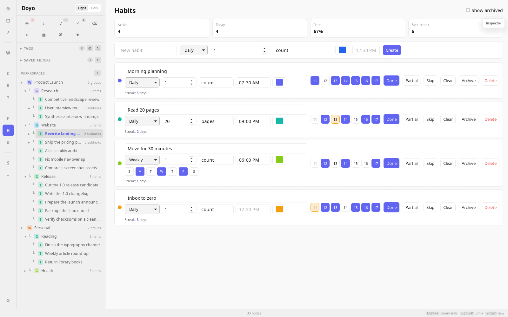
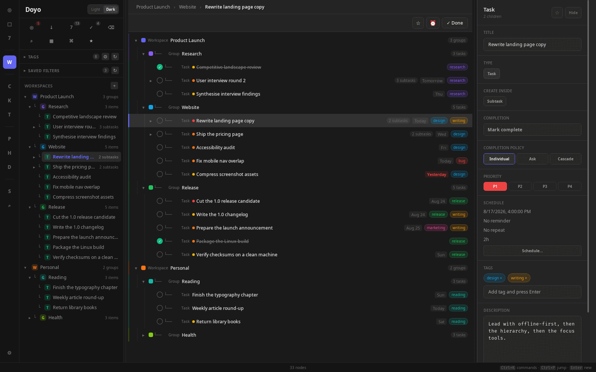

# Doyo

**A local-first productivity workspace for the Linux desktop.**

[](https://github.com/Hex1mal/doyo-desktop/releases/latest) [](https://github.com/Hex1mal/doyo-desktop/actions/workflows/ci.yml) [](LICENSE) [](https://github.com/Hex1mal/doyo-desktop/releases/latest)

Doyo keeps your workspaces, tasks, calendar, focus sessions, habits, and statistics in one SQLite database on your own machine. There is no account to create, nothing to sync, and no telemetry — it works with the network switched off.

**[Download the latest release](https://github.com/Hex1mal/doyo-desktop/releases/latest)** · [All releases](https://github.com/Hex1mal/doyo-desktop/releases) · Linux x86-64 `.deb`



## Why Doyo

- **Your data stays on your machine.** One local SQLite database. No account, no cloud backend, no analytics.
- **One hierarchy, many views.** Workspace → Group → Subgroup → Task → Subtask, nested as deeply as you like. Calendar, Kanban, Timeline, Matrix, and GTD are views over the same task records, not separate copies.
- **Planning and focus in the same app.** Schedule work on a calendar, then run a Pomodoro or stopwatch session against the task you scheduled.
- **Restores you can undo.** Doyo validates a backup before it touches your data, snapshots the current database first, and tells you the snapshot filename.
- **No lock-in.** Plain SQLite storage, JSON and Markdown export, AGPL-3.0 source.

## Key Features

- **Organize** — recursive workspaces and groups, tags, colors, favorites, drag-and-drop reordering and moves.
- **Find** — Today, Inbox, Next 7 Days, Completed, Trash, full-text search, and saved filters.
- **Plan** — Calendar with Month, Week, Day, and Agenda views, time blocks, recurrence, reminders, and estimated durations.
- **Track** — Kanban and Timeline boards grouped by status, priority, tag, workspace, or group.
- **Focus** — Pomodoro, Stopwatch, Timeboxing, Flowtime, Eisenhower Matrix, Eat the Frog, GTD, and Pareto.
- **Build habits** — daily and weekly habits with streaks, plus countdowns.
- **Review** — statistics for tasks, focus sessions, and habits.
- **Keep it safe** — local backup and restore, JSON import/export, and Markdown export.

## Screenshots

|                                                               Calendar planning                                                                |                                                             Kanban board                                                              |
| :--------------------------------------------------------------------------------------------------------------------------------------------: | :-----------------------------------------------------------------------------------------------------------------------------------: |
| [](docs/assets/screenshots/doyo-calendar.png) |         [](docs/assets/screenshots/doyo-kanban.png)         |
|                                                               **Focus sessions**                                                               |                                                              **Habits**                                                               |
|   [](docs/assets/screenshots/doyo-focus.png)   | [](docs/assets/screenshots/doyo-habits.png) |

Doyo ships light and dark themes.



## Install

### From the published release

1. Download `Doyo_1.0.1_amd64.deb` from the [latest release](https://github.com/Hex1mal/doyo-desktop/releases/latest).
2. Install it from the directory you downloaded it into:

   ```bash
   sudo apt install ./Doyo_1.0.1_amd64.deb
   ```

To verify the download first, fetch `SHA256SUMS` from the same release and run:

```bash
sha256sum -c SHA256SUMS
```

Doyo currently publishes a single package: a Debian/Ubuntu `.deb` for Linux on x86-64. There is no Windows, macOS, mobile, Flatpak, Snap, or AppImage build.

## Build From Source

Building requires Node.js 22, Rust, and the Linux development libraries listed in [docs/INSTALLATION.md](docs/INSTALLATION.md).

```bash
npm ci
npm run tauri build
```

Doyo is a Cargo workspace, so build output goes to `target/` at the repository root. The package is written to `target/release/bundle/deb/`.

Development server:

```bash
npm run tauri dev
```

Checks:

```bash
npm run check
npm run test:unit
cargo test
```

## Privacy And Data

Doyo works offline and stores everything locally. It has no account system, no sync service, and no analytics, and it makes no network requests for your data.

Your database lives in the Tauri application data directory for the identifier `io.github.hex1mal.doyo`:

```text
~/.local/share/io.github.hex1mal.doyo/doyo.db
```

**Backup and restore.** Use Settings → Data and Backup to create and restore local SQLite backups, which are written to `backups/` in the same directory. Before applying a backup, Doyo checks that it is an intact SQLite database with a compatible schema and refuses anything else rather than overwriting your data. It then snapshots your current database to `doyo-pre-restore-*.db` and reports that filename, so a restore can be rolled back. The restored database is loaded immediately — no manual restart.

**Import and export.** JSON import/export is a structured transfer format for moving records between Doyo databases; it is not a byte-for-byte backup. Use SQLite backup and restore for exact recovery.

**Reminders.** Habit and countdown reminders and focus-session alerts are delivered while Doyo is running. Doyo does not register reminders with the operating system scheduler, so they do not fire while the app is closed. A reminder that came due while Doyo was closed is delivered on the next launch if it is still due that day.

## Built With

Tauri 2 · SvelteKit and Svelte 5 · Rust · SQLite with additive migrations · Vitest and Rust integration tests.

## Documentation

- [User Guide](docs/USER_GUIDE.md) — views, scheduling, completion policies, and keyboard shortcuts
- [Installation](docs/INSTALLATION.md) — system dependencies, packaging, and desktop integration
- [Architecture](docs/ARCHITECTURE.md) — layers, data flow, and migrations
- [Database Schema](docs/DATABASE_SCHEMA.md)
- [Development](docs/DEVELOPMENT.md)

## Contributing

See [CONTRIBUTING.md](CONTRIBUTING.md).

## License

Doyo is licensed under AGPL-3.0-only. See [LICENSE](LICENSE).
